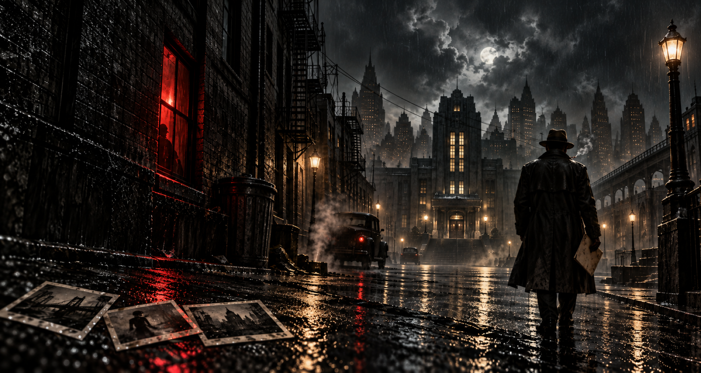

<p align="center">
  
</p>

<h1 align="center">Trueque Noir</h1>

<p align="center">
  <strong>Un expediente vivo para investigaciones noir en Foundry VTT.</strong><br>
  Llueve, alguien miente y el crimen corre más que vosotros.
</p>

<p align="center">
  <a href="#instalación">Instalación</a> ·
  <a href="#la-primera-partida-en-cinco-minutos">Primera partida</a> ·
  <a href="#las-dos-mesas">Las dos mesas</a> ·
  <a href="CONTENIDO.md">Qué incluye</a>
</p>

---

Trueque Noir lleva las reglas de *Balada triste de la ciudad* a Foundry sin convertirlas en un
formulario. La ficha no es una hoja escaneada: es el documento que el detective lleva encima.
La pantalla compartida no es un panel de control: es la mesa donde se amontonan las pistas.

- **Dos acciones y ninguna duda.** Riesgo y Perseguir el Crimen mandan en la cabecera. Todo lo
  demás aparece cuando hace falta y desaparece cuando no.
- **Diálogos que preguntan cómo afrontas la escena**, no cómo configuras una tirada. Cigarrillo y
  reconocimiento no se pueden acumular porque ni siquiera se dejan marcar a la vez; un favor
  anuncia «éxito automático» y apaga lo que ya no tiene efecto; antes de tirar ves exactamente
  qué vas a hacer.
- **Sobreexposición donde ocurre.** Aparece dentro de la tarjeta del resultado, y desaparece en
  cuanto esa tirada deja de ser la última.
- **El dado del crimen como personaje.** Domina la Mesa y el Panel, y avisa cuando explota.
- **La interfaz impide el error antes de que ocurra.** Objetos gastados, favores usados, tragos
  agotados o cigarrillos que no llegan: el control se desactiva y explica por qué.

## Compatibilidad

| Foundry VTT | Estado |
| --- | --- |
| 13 | Probado en la build 351 |
| 14 | Verificado en el manifiesto; el puente heredado vive aislado en `module/compat.mjs` |

Pensado para **escritorio, pantalla mediana o grande, ratón y teclado**. Se adapta a ventanas
estrechas, pero no compromete la vista de escritorio para imitar una interfaz táctil.

## Instalación

En **Configuración → Sistemas de juego → Instalar sistema**, pega este manifiesto:

```text
https://github.com/ManuRomera/trueque-noir/releases/latest/download/system.json
```

También puedes descargar `trueque-noir.zip` de la última versión y descomprimirlo en
`Data/systems/trueque-noir`.

## La primera partida en cinco minutos

Al crear el mundo, La Ciudad ve una pantalla de bienvenida con tres decisiones. No hay que
buscar nada por el menú.

1. **Construir la ciudad.** Un asistente de cuatro pasos: contexto y límites, las cuatro zonas,
   las localizaciones y un resumen antes de guardar. Hay generación aleatoria completa si
   prefieres partir de una propuesta.
2. **Crear detectives.** Cinco pasos: identidad, objetos representativos, pilares, balada triste
   y un resumen del detective antes de crearlo. También se genera entero al azar.
3. **Empezar un caso.** Abre el Panel de La Ciudad: nombre del caso, día, límite y franja. Todo
   se guarda solo.

La bienvenida vuelve a abrirse cuando quieras desde el menú **Trueque Noir** de los controles de
escena. Ahí están también el Panel, la Mesa, los asistentes y el archivo de casos.

El sistema prepara además una **escena de portada de 1920 × 1024**, sin cuadrícula, sin niebla de
guerra y sin visión de token: al activarla aparece encuadrada y a pantalla completa sin tocar el
zoom. Solo esa escena se reencuadra sola; las tuyas conservan su cámara.

## Las dos mesas

**Mesa del caso** es el HUD compartido. Muestra el caso, el día y la franja, el dado del crimen
en grande, las pistas descubiertas y las que quedan sin gastar, y el rumor pendiente si lo hay.
Nada más. La Ciudad la muestra u oculta para todo el grupo con un clic.

**Panel de La Ciudad** dirige la investigación. Arriba, lo que se toca cada franja: caso, día,
límite, dado del crimen y pistas. Debajo, plegado hasta que hace falta: la ciudad, los
detectives, el trueque, la acusación y la administración. Reiniciar el caso pide confirmación
explícita y vive separado del resto.

## La ficha del detective

Tres secciones, sin subpestañas:

- **Personaje** · identidad, trasfondos, pilares y su tensión, recursos, estados y objetos,
  favores y la balada triste.
- **Investigación** · pistas y sus notas, contactos, los tres usos del cigarrillo y el rumor
  pendiente del caso.
- **Expediente** · cronología, sospechosos, hipótesis, escenas importantes y notas generales.

La cabecera mantiene siempre a la vista lo que se consulta jugando: retrato, nombre, función,
estados activos como sellos, caso y franja, cigarrillos, reconocimiento disponible, dado del
crimen y pistas del caso.

## Ayuda y preferencias

Reposa el ratón sobre cualquier control y la explicación aparece sola; el clic derecho la fija
hasta que pulses fuera. Donde la regla no es evidente hay un `?` discreto.

En **Configuración → Ajustes del sistema**:

- **Retratos en blanco y negro** · activado por defecto, desactivable.
- **Instalar macros en la barra rápida** · desactivado por defecto. Todo está en el menú
  Trueque Noir.

## Qué incluye realmente

El sistema trae su código, su interfaz, la ilustración de portada y el cigarrillo de la ficha.
Incluye además un archivo de **veinte casos escritos por Pepe Pedraz, Jorge Serrano y Mirella
Machancoses**, que **no se importa solo**: La Ciudad decide si quiere crearlos como diarios
privados. [CONTENIDO.md](CONTENIDO.md) detalla qué se distribuye, qué se retiró y qué decisión
de derechos queda pendiente.

## Desarrollo

Sin dependencias de ejecución. Antes de publicar:

```bash
node tools/check.mjs
```

Comprueba plantillas, rutas, imports, manifiesto, ajustes y que ningún botón se quede sin acción.
Las etiquetas `v*` publican automáticamente el ZIP instalable y el manifiesto.

## Créditos

Sistema para Foundry VTT de [Manu Romera](https://github.com/ManuRomera). Código bajo la licencia
de [LICENSE](LICENSE).

Implementación **no oficial**. *Balada triste de la ciudad*, sus textos e ilustraciones
pertenecen a sus titulares. Para jugar necesitas una copia legítima del manual.
