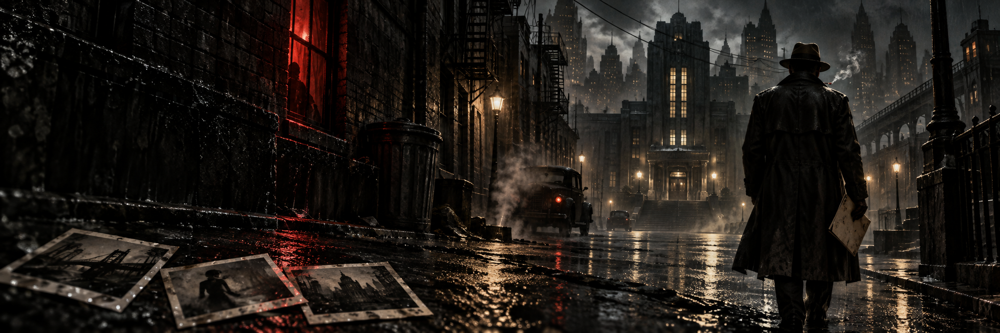

# Trueque Noir para Foundry VTT

Un sistema de investigación noir para Foundry VTT 13 y 14, inspirado en las reglas de *Balada triste de la ciudad*. La interfaz funciona como un expediente vivo: mantiene visibles las decisiones que importan sin convertir la mesa en un panel administrativo.

> Este proyecto es una implementación no oficial. No incluye el texto, las ilustraciones ni los casos del libro. Para jugar necesitas una copia legítima del manual.

## Lo esencial, siempre a la vista

La cabecera de cada detective muestra el caso y la franja actuales, cigarrillos, reconocimiento, dado del crimen y pistas del grupo. Desde el mismo lugar se accede a las dos acciones centrales: **Riesgo** y **Perseguir el crimen**.

- Tiradas con trasfondo, penalizador, noche, cigarrillos, reconocimiento, rumores, objetos y favores.
- Trueques y consecuencias explicados directamente en el chat.
- Sobreexposición de pilares: repite la última tirada una sola vez, aumenta tensión y sustituye sus efectos.
- Pistas compartidas, reducción automática del dado del crimen y explosión del crimen.
- Contactos, historias turbias, descansos nocturnos y tragos tranquilos.
- Acusación guiada con las preguntas «¿Quién?», «¿Qué?» y «¿Por qué?».
- Interludios completos, incluidos estados, tensión, cajetillas, favores y tercer trasfondo.

## Dos espacios, una sola investigación

**Mesa del caso** ofrece al grupo una lectura limpia del tiempo, las pistas, el rumor pendiente y el dado del crimen.

**Panel de la Ciudad** concentra las herramientas de dirección: franjas, límite del caso, consecuencias, descanso, acusación, interludios y reinicio de recursos por caso.

Ambos se abren desde las macros que el sistema instala automáticamente en la barra rápida. El Panel de la Ciudad también está disponible desde la ficha del detective.

## Dirección artística y accesibilidad

El diseño emplea una paleta de carbón, papel envejecido, ámbar y rojo de cuarto oscuro. El arte de portada y el cigarrillo de la interfaz son recursos originales creados para este sistema.

- Contraste alto y foco de teclado visible.
- Interfaz adaptable a ventanas estrechas.
- Movimiento reducido cuando el sistema operativo así lo solicita.
- Corrección explícita de pestañas para ApplicationV1 en Foundry 14.
- Los iconos decorativos no sustituyen ninguna etiqueta textual.

## Compatibilidad

| Foundry VTT | Estado |
| --- | --- |
| 13 | Probado en Build 351 |
| 14 | Compatible mediante el puente `foundry.appv1`; manifiesto verificado para v14 |

La capa heredada ApplicationV1 continúa disponible durante Foundry 14. El puente está aislado en `module/compat.mjs` para que la futura migración a ApplicationV2 no contamine la lógica de juego.

## Instalación

Usa este manifiesto en **Configuración → Sistemas de juego → Instalar sistema**:

```text
https://github.com/ManuRomera/trueque-noir/releases/latest/download/system.json
```

También puedes descargar `trueque-noir.zip` desde la última versión publicada y descomprimirlo en `Data/systems/trueque-noir`.

## Desarrollo y pruebas

El repositorio no necesita dependencias de ejecución. Antes de una publicación se validan la sintaxis de todos los módulos, los JSON y la estructura del paquete. Las versiones etiquetadas crean automáticamente un ZIP instalable y un manifiesto independiente.

## Créditos y licencia

Sistema para Foundry VTT desarrollado por [Manu Romera](https://github.com/ManuRomera). Código distribuido bajo la licencia incluida en [LICENSE](LICENSE).

*Balada triste de la ciudad*, Trueque Noir y sus contenidos editoriales pertenecen a sus respectivos titulares. Este repositorio no redistribuye el manual.
